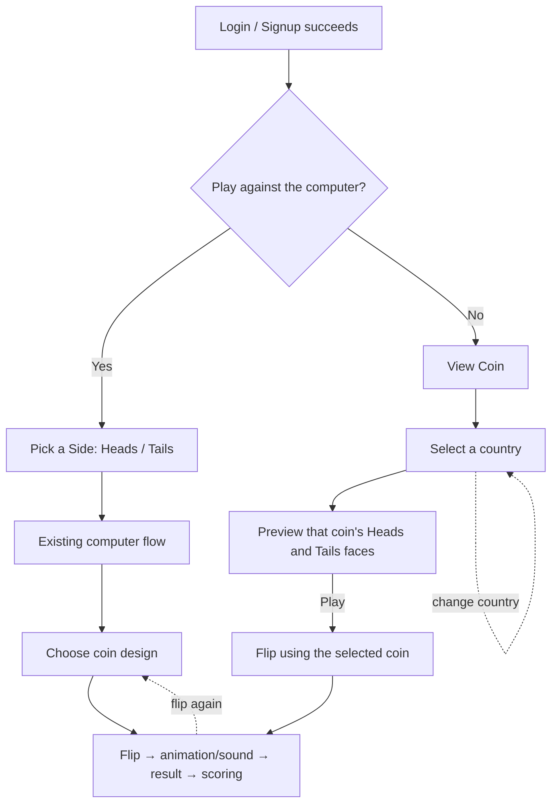

# Game Flow

This document specifies the post-login game flow. It is the source of truth
for how the "play vs. computer?" decision affects what the player sees, and
what still needs to be wired up in code to match it.

**Non-goals — explicitly unchanged by this flow:**
- Coin animation (`Coin.jsx`'s 3D spin/rim/easing)
- Sound effects (`utils/soundEffects.js`)
- Result computation (server-side `crypto.randomInt`, offline RNG fallback)
- Scoring (`ScoreBoard`, `/api/flips/user/stats`, win/loss/streak logic)
- Visual styling/theme of any existing screen

Only *which screens appear, in what order* changes.

## 1. Trigger

Every successful **login** or **signup** opens the prompt:

> "Do you want to play against the computer?"

This already exists: `AuthContext.login()` / `AuthContext.signup()` set
`isPlayPromptOpen = true` on success, rendered by `PlayPromptModal`. Session
restore (existing token on page load) does **not** re-trigger it — only an
explicit login/signup action does. Logging out resets state so the next
login asks fresh.

Guests (not logged in) never see this prompt and always get the default
"Yes" experience (full game, `Pick a Side` visible) described below.

## 2. Branches



### Yes → "Pick a Side"
Unchanged from the current implementation:
- `pickSideEnabled = true`
- Full game card renders: sound toggle, 3D coin, status text, `ChoiceSelector`
  (Heads/Tails), `CountrySelector`, Flip button.
- This *is* "playing against the computer": the player calls a side before
  each flip and wins/loses against the server's random result.

### No → "View Coin" → "Play"
This is the part that changes. Today, answering **No** only shows
`CoinViewer` (country picker + static Heads/Tails preview) as a dead end —
there is no way back into the flip game from that screen. The target flow
adds a third step:

1. **View Coin** — `CoinViewer` as it exists today: `CountrySelector` +
   two static face discs (Heads/Tails) for the chosen coin. No flipping yet.
2. Player can switch countries freely; the preview updates immediately with
   no animation (same static face rendering already in `CoinViewer`).
3. A **"Play"** button (new) commits the currently-previewed coin and
   transitions into the flip game — the *same* `gameCard` used by the Yes
   branch (same `Coin.jsx`, same Flip button, same sound/animation/scoring),
   but **without** `ChoiceSelector` — this branch never asks the player to
   call heads/tails against the computer, matching their "No" answer.
   The coin design carries over from step 1 (no need to re-pick it in
   `CountrySelector` inside the game card, though the existing
   `CountrySelector` there still lets them change it mid-play, unchanged).
4. Flipping from this state uses the exact same `useCoinGame` flip logic,
   result handling, and `ScoreBoard`/history recording as the Yes branch —
   only the "call a side first" step is skipped.

## 3. State model

Current (`AuthContext`):
- `isPlayPromptOpen: boolean` — controls `PlayPromptModal` visibility.
- `pickSideEnabled: boolean` — `true` (Yes / guest / default) shows the full
  game with `ChoiceSelector`; `false` (No) currently renders `CoinViewer`
  only, with no exit.

**Needed addition** to support "View Coin → Play": a third value so the
"No" branch can distinguish *previewing* from *playing*. Simplest option —
replace the boolean with a small enum on `AuthContext` (or add one sibling
flag alongside it), e.g.:

```
gameMode: "pickSide" | "viewCoin" | "casualPlay"
```

- `pickSide` — today's Yes path (`ChoiceSelector` shown).
- `viewCoin` — today's No path, `CoinViewer` only.
- `casualPlay` — new: game card shown, `ChoiceSelector` hidden, entered by
  pressing "Play" in `CoinViewer`.

`Home.jsx` branches on `gameMode` instead of the current boolean:
`pickSide` and `casualPlay` both render the existing game card (the latter
simply omitting `ChoiceSelector`); `viewCoin` renders `CoinViewer` with a
"Play" button that sets `gameMode = "casualPlay"` and seeds `coinId` from
the coin last previewed.

## 4. Edge cases

- **Switching coins mid-preview**: allowed, no confirmation needed — the
  "Play" button always uses whatever coin is currently shown.
- **Switching coins after pressing Play**: unaffected — `CountrySelector`
  inside the game card already lets the player change coins mid-session
  today, in both branches.
- **Re-answering the prompt**: not possible mid-session by design; the
  player must log out and back in to get asked again (existing behavior).
- **Flip while offline**: unaffected — the existing local-RNG fallback in
  `useCoinGame` applies identically in both branches.

## 5. Implementation checklist (not yet done)

- [ ] Replace/extend `pickSideEnabled` with the `gameMode` tri-state above
      in `AuthContext.jsx`.
- [ ] Add a "Play" button to `CoinViewer.jsx` that calls a new
      `startCasualPlay()` (or similar) from `AuthContext`.
- [ ] Update `Home.jsx`'s branch to route `casualPlay` into the existing
      game card with `ChoiceSelector` omitted (reusing the same markup the
      Yes-branch already has, minus that one component).
- [ ] No changes needed in `Coin.jsx`, `useCoinGame.js`, sound effects,
      `ScoreBoard`, or the backend — the flip mechanics are already
      side-agnostic (a default `choice` is used when `ChoiceSelector` is
      hidden, same as today's No-branch flip behavior).
